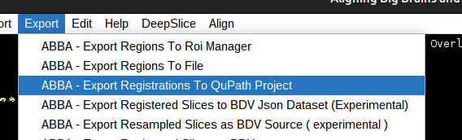
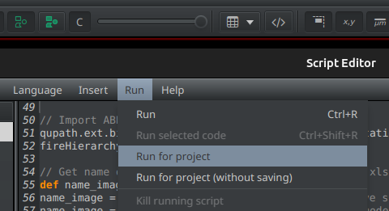

# intership_neurorestore_pipeline

This folder contains a series of scripts that are used for implementiang a regitration and quantification pipeline.

## Export Registratiosn from ABBA to QuPath
In ABBA:
- Select all the slices (`Ctrl+A`)
- In the top menu bar `Export > ABBA - Export Registrations To QuPath project`

    

## QuPath Quantification and Export
In QuPath:
- Open the pre-existing project that contains your image data
- Access the script editor within QuPath to input custom scripts
- Insert the [measurements_slices_xls.groovy](QuPath_scripts/measurements_slices_xls.groovy) script, which automates the analysis workflow
- Select `Run → Run for Project` to apply the script to all images within the project

    

> **Note:** For specific steps performed in `measurements_slices_xls.groovy`, please check the script documentation.

## Merging all .tsv files in one csv for one Brain
The previous step creates one .tsv file for each slice/brain image of the project. 
Run the script [create_csv_whole_brain.py](create_csv_whole_brain.py) for merging all these .tsv files in one single csv file.

>**Note**: the script is meant to run on multiple brains at the same time, pay attention to give as input the root folder of the whole project and to respect the structure of the filesystem expted by the script.

