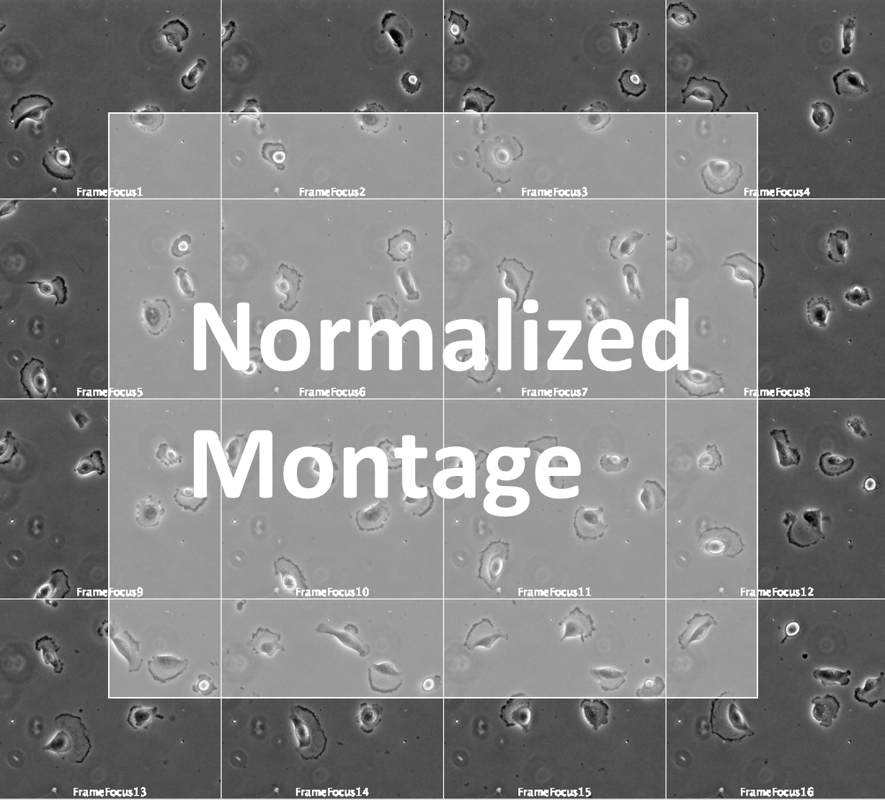

### **[Moodle BIO-410](https://moodle.epfl.ch/course/view.php?id=15721)**  

><h3 style="font-weight:500; font-size:1.6em">Single Slice Point Detector (SSPD)</h3>
>
>Made by: Gabrieele Dall'Aglio, EPFL 
>  

#  Expected input
The Plugin works with a .tiff image that represent the slice of a mouse brain.
The image should have overlayed the coregistered atlas obtained by ABBA tool.
This an example of pipeline to follow before applying this plugin:
- Finish registration in ABBA and export the project on QuPath
- In QuPath, apply the script "[split_annotations_right_left.groovy](..%2F587%2Fscripts%2Fsplit_annotations_right_left.groovy)" to change the name of the labels in irder to have left and right.
- Select onlt the channel for the quantification
- Export slice in ImageJ, with the following parameters:
    - Resolution: closer to 0 better it is, but more space
    - Resolution unit: Micrometer
    - Include ROIs: yes
    - Include Overlay: yes
    - Apply color transform: yes (only export the current channel, i.e. the one where to quantify)
- On Fiji save the image as .tiff

ATTENTION: probably you have to increase the size of the allocated memory in ImageJ IDE

## Data
- A 4D images XYZT dataset showing a colony of glioblastoma during 16 frames.
`glioblastoma_4D_corrupted.tif`. You can find the sequence related to this homework on the OMERO database ; under the ``Homework B`` project. 
Link to images : [https://omero.epfl.ch/webclient/?show=project-2849](https://omero.epfl.ch/webclient/?show=project-2849)

   

